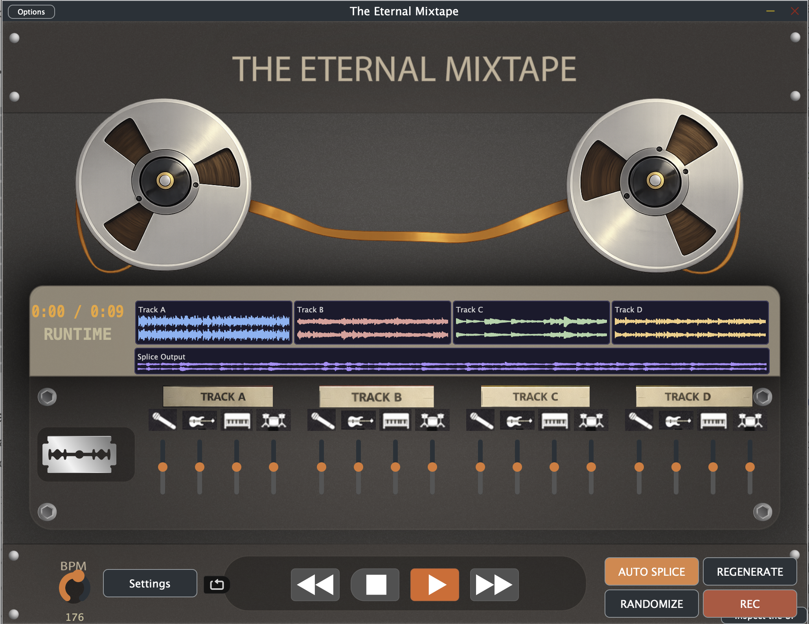

# The Eternal Mixtape — User Manual

*Version 1.1 · GT MUSI6106 · Spring 2026*

---

## Table of Contents

1. [Welcome](#1-welcome)
2. [Quick Start — Sound in 60 Seconds](#2-quick-start--sound-in-60-seconds)
3. [The Interface at a Glance](#3-the-interface-at-a-glance)
4. [Loading Your Tracks](#4-loading-your-tracks)
5. [Playback & Transport](#5-playback--transport)
6. [BPM Control](#6-bpm-control)
7. [Per-Track Stem Faders](#7-per-track-stem-faders)
8. [Splice — The Core Feature](#8-splice--the-core-feature)
   - [Simple Mode (default)](#simple-mode-default)
   - [Expertise Mode — hold Cmd](#expertise-mode--hold-cmd)
   - [AUTO SPLICE](#auto-splice)
   - [REGENERATE](#regenerate)
   - [RANDOMIZE](#randomize)
9. [Stem Separation](#9-stem-separation)
10. [Recording Output](#10-recording-output)
11. [Settings](#11-settings)
12. [Workflows & Tips](#12-workflows--tips)
13. [Glossary](#13-glossary)

---

## 1. Welcome

The Eternal Mixtape is a creative audio tool for building remixes and mixtapes without needing to know music theory, a DAW, or a DJ setup. Drop in up to four songs, set a target tempo, and let the application splice, shuffle, and blend them into something new.

The design follows one guiding principle: **simple actions in simple mode, deeper control when you want it.** You never have to touch the advanced features to get a result. But when you're ready to go further — stem separation, per-beat tempo warping, expert splice routing — it's all there, one key press away.

**Two modes run throughout the whole application:**

| Mode | How to activate | What changes |
|---|---|---|
| **Simple** | Default — no keys held | One-click actions on raw audio |
| **Expertise** | Hold **Cmd** (macOS) | Same buttons operate on separated stems; stem panel becomes visible |

---

## 2. Quick Start — Sound in 60 Seconds

1. Launch **The Eternal Mixtape** (standalone app).
2. Drag an audio file (WAV, MP3, AIFF) onto the **Track A** waveform panel.
3. Press **▶ Play** in the transport bar. You will hear your track.
4. Drag a second audio file onto **Track B**.
5. Press **AUTO SPLICE**. In a few seconds the Splice Output panel fills with a waveform.
6. Press **▶ Play** again. You are now listening to a beat-shuffled, tempo-matched blend of both tracks.

That is the entire core workflow. Everything else in this manual is about going deeper.

---

## 3. The Interface at a Glance



### Panel-by-panel guide

**Title & tape reels (top)**
The decorative tape-reel animation at the top frames the cassette aesthetic. Below it sits the orange **RUNTIME** LED display showing elapsed and total time for whatever is currently playing (`0:00 / 0:09` in the image above).

**Waveform row (middle-upper)**
Four colour-coded waveform panels display the audio loaded into each track:

| Track | Colour |
|---|---|
| Track A | Blue |
| Track B | Pink |
| Track C | Green |
| Track D | Amber |

The wider purple panel below them — **Splice Output** — shows the result of any splice operation. This is what plays when you press Play after splicing.

**Track mixer strips (middle-lower)**
Each track has a label icon (A/B/C/D) and four stem channels beneath it: **Vocals, Bass, Other, Drums**. Each stem channel shows a small icon and a vertical gain fader. See [Per-Track Stem Faders](#7-per-track-stem-faders).

**Splice razor button (left panel)**
The razor-blade icon on the left triggers the SPLICE operation on the active track. See [Splice — The Core Feature](#8-splice--the-core-feature).

**BPM knob (bottom-left)**
A rotary dial for setting the global target tempo. Turning it re-stretches the active track in real time. See [BPM Control](#6-bpm-control).

**Transport bar (bottom centre)**
Left to right: **Settings**, **Loop toggle**, **◀◀ Back**, **■ Stop**, **▶ Play**, **▶▶ Forward**.

**Remix buttons (bottom-right)**
**AUTO SPLICE**, **REGENERATE**, **RANDOMIZE**, and **REC** — the four main creative actions.

**Options button (top-left corner)**
Opens the UI inspector (a developer tool for layout debugging). Not part of the normal user workflow.

---

## 4. Loading Your Tracks

### Drag and drop

Drag any audio file directly onto one of the four track waveform panels (Track A, B, C, or D). The waveform renders immediately and the track becomes available for playback and splicing.

**Supported formats:** WAV, AIFF, MP3, FLAC

You can load all four tracks independently in any order. Tracks do not need to have the same length, key, or BPM.

### What happens when you drop a file

When you drop a file onto any track panel, three things happen simultaneously:

1. The waveform renders in that track's panel.
2. That track becomes the **active track** (the one the transport plays and the stem panel refers to).
3. The **stem separation panel auto-populates** with that track's file path and its expected `_stems/` output directory — ready for you to run Separate whenever you choose.

You are never locked into a particular file path in the stem panel. It always reflects the most recently loaded track.

### Each track owns its own stems

Every track maintains a separate stem directory:

```
Track A → song1_stems/    ← Track A's stems (drums, bass, other, vocals)
Track B → song2_stems/    ← Track B's stems
Track C → song3_stems/    ← Track C's stems (empty until separated)
Track D → song4_stems/    ← Track D's stems (empty until separated)
```

Once you separate Track A, its `_stems/` folder is stored against slot A. Separating Track B stores its folder against slot B — it does not overwrite Track A's stems. You can separate each track independently at any time.

### Track order matters for AUTO SPLICE

AUTO SPLICE always blends the **active track** with the **next loaded track** in order (A→B→C→D→A). Load your preferred songs into adjacent slots before pressing AUTO SPLICE. For example, Song 1 into Track A and Song 2 into Track B, then make Track A active before pressing AUTO SPLICE.

### Pre-existing stems are detected automatically

If a `_stems/` folder already exists next to your audio file (from a previous session), dropping that file onto any track instantly registers those stems against that track's slot. No re-separation needed — the splice engine can use them immediately.

---

## 5. Playback & Transport

### ▶ Play / ■ Stop

**▶ Play** starts playback of whatever is loaded: the active track or — after a splice — the Splice Output. Pressing it again, or pressing **■ Stop**, halts playback and returns to the beginning.

### ◀◀ Back and ▶▶ Forward

These buttons cycle through the loaded tracks:

- **▶▶ Forward** switches the active track to the next slot (A→B→C→D→A) and plays from the start.
- **◀◀ Back** switches to the previous slot (A→D→C→B→A) and plays from the start.

Use these to audition each loaded track in sequence before splicing.

### Loop

The **Loop** toggle (the circular-arrows icon, left of ◀◀) repeats the active track or splice output continuously. Useful when auditioning a splice result or checking BPM alignment.

---

## 6. BPM Control

The **BPM rotary knob** (bottom-left, labelled with the current value such as *176*) sets the global target tempo for the entire session.

**What it affects:**

- **Active track playback** — the track is re-stretched in real time using a phase-vocoder time-stretcher. Pitch is preserved; only the speed changes.
- **Splice operations** — all beat chunk lengths and time-stretch ratios are derived from this BPM value.

**Debounce:** The re-stretch does not fire on every knob tick. It waits ~500 ms after you stop turning the knob before processing, so rapid adjustments do not cause stuttering.

**Finding the right BPM:**

Match the knob to the source material's original tempo for the tightest beat-grid alignment. A slight mismatch will cause beats to be cut in the middle of notes. A large mismatch (say, 80 BPM source spliced at 160 BPM) produces a double-time glitch effect — sometimes intentional, always interesting.

---

## 7. Per-Track Stem Faders

Each of the four tracks has a mixer strip with four vertical faders, one per stem:

| Icon | Stem | What it controls |
|---|---|---|
| Microphone | Vocals | Volume of the separated vocal layer |
| Bass guitar | Bass | Volume of the separated bass layer |
| Keyboard | Other | Volume of guitars, synths, and any non-vocal, non-bass material |
| Drum kit | Drums | Volume of the separated drum layer |

**Range:** 0 (silent) to 2.0 (double gain). Default is 1.0 (unity).

**In Simple Mode:** The faders are visible but do not shape the audio yet — stem separation has not been run. Their settings are remembered so you can dial in the mix before separating.

**In Expertise Mode (Cmd held) — the faders become input shaping for splice:**
Each fader controls its stem's contribution to whatever the splice engine receives. This is not a playback mixer — it shapes what goes *into* the splice operation:

- Pull Track A's **Vocals** fader to 0 before pressing SPLICE → the splice output contains no vocals from Track A (instrumental remix)
- Boost Track B's **Drums** fader to 2.0 → Track B's drums are twice as prominent in the splice blend
- Zero out all stems except **Bass** → the splice output is a bass-only remix

Each track's four fader positions are independent. You can shape Track A and Track B differently before AUTO SPLICE blends them.

---

## 8. Splice — The Core Feature

Splice cuts audio at beat boundaries and re-assembles the segments in a new order at the target BPM — the digital equivalent of physically cutting a tape and re-splicing the pieces in a different sequence.

---

### Simple Mode (default)

All splice operations work directly on **raw audio**. No stem separation required.

**SPLICE** *(the razor blade button)*

Chops the **active track** into beats, shuffles them with a fixed random seed, and re-assembles the result at the target BPM. Every press with the same settings produces the same output (deterministic). Use this to preview what a splice sounds like at the current BPM.

---

### Expertise Mode — hold Cmd

Hold **Cmd** at any time to enter Expertise Mode. The stem separation panel becomes visible and all four splice buttons now operate on **separated stems** rather than the raw track mix.

This gives beat detection more to work with (the drums stem has the clearest transients) and lets you shape the result at the stem level before splicing. All stems receive the **same beat permutation** so drums and bass stay rhythmically locked after shuffling.

To use Expertise Mode productively, run [Stem Separation](#9-stem-separation) first.

---

### AUTO SPLICE

AUTO SPLICE is the true *mixtape* operation. It blends **two songs** together.

**Simple mode:**

1. Takes the **active track** and the **next loaded track** (e.g., A and B).
2. Interleaves them in alternating 2-bar (8-beat) chunks: `[A · A] [B · B] [A · A] [B · B] …`
3. Passes this combined audio through the splice engine — beat detection, shuffle, BPM normalization.
4. The result in the Splice Output panel jumps between both songs at the beat level.

If only one track is loaded, AUTO SPLICE falls back to a single-track self-remix.

AUTO SPLICE uses a **fixed random seed**, so the same BPM and loaded tracks produce the same result every time. For a different arrangement, use [REGENERATE](#regenerate).

**Expertise mode (Cmd held):**
Routes through each track's own registered stem directory. Track A uses `song1_stems/`, Track B uses `song2_stems/`, and so on — each independently shaped by that track's fader positions. Result uses seed 42 for reproducibility.

---

### REGENERATE

REGENERATE runs the same two-track interleave as AUTO SPLICE but with a **new random seed** drawn from the clock at the moment you press it. Each press gives a completely different beat order at the same BPM.

Use REGENERATE when you like the overall blend of two tracks but want to hear a fresh arrangement. Pair it with Loop to audition each version on repeat.

---

### RANDOMIZE

RANDOMIZE adds **per-beat tempo variation** on top of the shuffle. Instead of stretching every beat uniformly to the target BPM, each individual beat chunk is stretched by a random factor between **0.5× and 1.8×** of the target beat length.

The effect: the tempo *wanders* throughout the piece. Some beats land early, some late. The overall structure is still beat-organized, but the mechanical clock disappears — more like a human performance or a lo-fi tape warble.

RANDOMIZE also draws a new random seed each press, so every result is unique.

**When to reach for each button:**

| Goal | Button |
|---|---|
| Same result every time, consistent tempo | AUTO SPLICE |
| New beat arrangement, consistent tempo | REGENERATE |
| New beat arrangement + wandering tempo | RANDOMIZE |
| Self-remix of a single track | SPLICE (razor) |

---

## 9. Stem Separation

Stem separation uses the Demucs neural network to split a full mix into four isolated audio layers. This unlocks the per-fader mix controls and the Expertise Mode splice routing.

**The four stems and their waveform colours:**

| Stem | Colour |
|---|---|
| Drums | Red |
| Bass | Green |
| Other (guitars, synths, etc.) | Orange |
| Vocals | Blue |

### The separation flow

Stem Separation is only visible in **Expertise Mode** (hold Cmd). Here is the complete flow:

**Step 1 — Drop your file onto the track.**
Drop a file onto Track A, B, C, or D. The stem panel immediately auto-fills with:
- **Input:** the path to the file you just dropped
- **Output:** the expected `_stems/` folder path (placed next to the source file)

You do not need to touch the Input or Output fields manually. They always reflect the most recently active track.

**Step 2 — Set the Model path (once).**
The **Model** field points to your local Demucs `.onnx` model file. Browse to it once; it is remembered between sessions.

**Step 3 — Decide when to separate.**
The stem panel is ready but nothing runs automatically. Demucs takes 30 seconds to several minutes per track, so you control when to commit. When you are ready:

- Press **Separate** to begin. A progress bar shows inference progress.
- Press **Cancel** at any time to abort cleanly (no partial files are saved).

**Step 4 — Separation completes.**
The four stem waveforms appear colour-coded below the panel. The stems are now registered against this track's slot — pressing SPLICE or AUTO SPLICE in Expertise Mode will use them.

**Step 5 — Separate other tracks independently (optional).**
Drop a file onto Track B. The stem panel updates to reflect Track B's paths. Separate it. Track A's stems are still registered — each track owns its slot permanently until you drop a new file.

**CUDA toggle:** If you have an NVIDIA GPU, enable this toggle before pressing Separate. Inference routes through the GPU and can be 5–10× faster than CPU-only.

### Stems persist between sessions

Stems are written to `_stems/` next to the source file. Drop that same file onto any track in a future session and its stems are detected and registered instantly — no re-separation needed.

---

## 10. Recording Output

The **REC** button (bottom-right, red) records the current Splice Output to a WAV file in your configured `export_output_dir` folder (see [Settings](#11-settings)).

Press REC once to start recording; press again to stop and finalise the file. The recorded file is timestamped automatically so successive takes do not overwrite each other.

---

## 11. Settings

The **Settings** button (bottom-left transport bar) opens a folder browser that lets you choose where exported files are saved (`export_output_dir`). This is the directory that receives:

- Splice output WAV files written by the splice engine
- Recorded output from the REC button

All other file path configuration (stem model location, stem output folder, audio import folder) is managed through the stem separation panel when in Expertise Mode.

**Config path keys** (persisted between sessions):

| Key | What it stores |
|---|---|
| `imported_audio_dir` | Default folder opened by file browsers |
| `stem_model_file` | Path to the Demucs ONNX model |
| `stem_output_dir` | Where `_stems/` directories are written |
| `export_output_dir` | Where splice outputs and REC files are saved |

---

## 12. Workflows & Tips

### Workflow A — Two-song mixtape (Simple Mode)

1. Drop **Song 1** onto Track A.
2. Drop **Song 2** onto Track B.
3. Set the BPM knob to match the dominant groove of Song 1 (or split the difference between the two tracks).
4. Press **AUTO SPLICE** → listen.
5. If the blend feels flat, press **REGENERATE** a few times. Enable Loop so you can hear each version on repeat.
6. To make the tempo feel more alive and organic, switch to **RANDOMIZE**.

### Workflow B — Single-track creative remix

1. Drop one track onto Track A.
2. Dial in the track's original BPM on the knob.
3. Press **SPLICE** (razor) for a deterministic self-remix at that BPM.
4. Press **REGENERATE** to hear a differently shuffled version each time.
5. Try **RANDOMIZE** to introduce tempo drift throughout the piece.

### Workflow C — Expert stem blend (Expertise Mode)

1. Drop **Song 1** onto Track A. The stem panel auto-fills with Track A's paths.
2. Hold **Cmd** to enter Expertise Mode. Confirm the Model path is set (once per machine).
3. Press **Separate** and wait for Demucs to finish Track A. The four colour-coded stem waveforms appear.
4. Shape Track A's input mix using its four faders — for example, pull **Vocals** to 0 for an instrumental-only splice source.
5. Drop **Song 2** onto Track B. The stem panel now reflects Track B's paths. Track A's stems remain registered.
6. Press **Separate** again to separate Track B independently.
7. Shape Track B's faders however you like (different from Track A — each track's faders are independent).
8. Hold **Cmd** and press **AUTO SPLICE** to blend both tracks' shaped stem inputs into the final splice output.

### Tips

- **BPM first.** Set your target BPM *before* pressing any splice button. Changing BPM after a splice does not automatically redo the splice — you need to press the splice button again.
- **Adjacent tracks for AUTO SPLICE.** The engine always blends the active track with the *next loaded* slot. Keep your two target tracks in adjacent slots (A+B, B+C, etc.).
- **RANDOMIZE is not chaos.** The per-beat stretch range is 0.5×–1.8×, which sounds more like a pushed-and-pulled human performance than random noise.
- **Loop + REGENERATE is the fastest audition flow.** Enable Loop, press REGENERATE, let it play, press again for the next version — no stopping or restarting needed.
- **Stems save time.** Separate once; the `_stems/` folder is auto-detected every future session so you never re-run the slow Demucs pass.
- **BPM mismatch is a feature.** Splicing a 90 BPM track at 180 BPM produces a double-time glitch effect. Splicing at 45 BPM produces a half-time woozy feel. Both can be musically compelling.
- **REC captures exactly the splice output.** Whatever is in the Splice Output panel is what gets recorded. Make sure you hear the version you want before pressing REC.

---

## 13. Glossary

**Beat** — The basic rhythmic pulse unit derived from the global BPM setting. The splice engine chops audio at beat boundaries.

**BPM (Beats Per Minute)** — Tempo measurement. 120 BPM = 2 beats per second. All splice operations normalise audio to this target.

**Demucs** — A neural network for music source separation, developed by Meta Research. The Eternal Mixtape uses the ONNX version (`demucs.onnx`) for cross-platform CPU/GPU inference.

**Expertise Mode** — The advanced layer, activated by holding Cmd. Splice operations route through separated stems; the stem separation panel becomes visible.

**ONNX** — Open Neural Network Exchange format. The model file format used by the embedded Demucs inference engine.

**Phase vocoder** — The time-stretching algorithm behind the BPM slider. Changes tempo without changing pitch by manipulating audio frequency-component phase relationships.

**RANDOMIZE** — A splice pass where each beat chunk is individually time-stretched by a random factor (0.5×–1.8× of the target beat length), producing non-uniform tempo variation.

**REGENERATE** — A splice pass identical in structure to AUTO SPLICE but using a new random seed, yielding a different beat shuffle each time.

**Seed** — A number used to initialise a random number generator. The same seed always produces the same shuffle. AUTO SPLICE uses seed 42 (fixed, reproducible); REGENERATE and RANDOMIZE draw from the clock (always different).

**Simple Mode** — The default layer. Splice functions operate on raw audio; no stem separation required.

**Splice** — Cutting audio at beat boundaries, reordering the segments, and reassembling them at a target tempo.

**Stem** — An isolated audio layer produced by Demucs: Drums, Bass, Vocals, or Other.

**Stem separation** — The offline process of running Demucs to split a full mix into its four constituent stems. CPU time varies from ~30 seconds to several minutes depending on track length and hardware; GPU (CUDA) is significantly faster.

---

*The Eternal Mixtape · GT MUSI6106 · Spring 2026*  
*Authors: Alex Akstens, Ryan Baker, Matias Cevallos, Evelyne Li, Marcus Parker*
